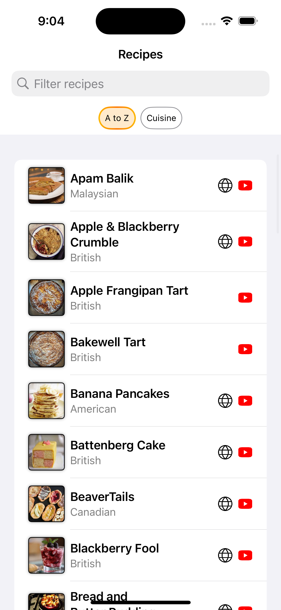
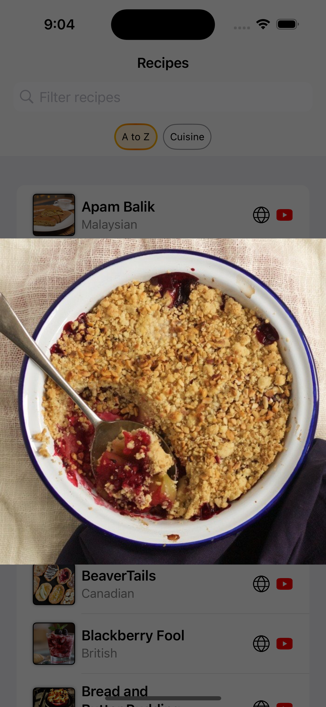
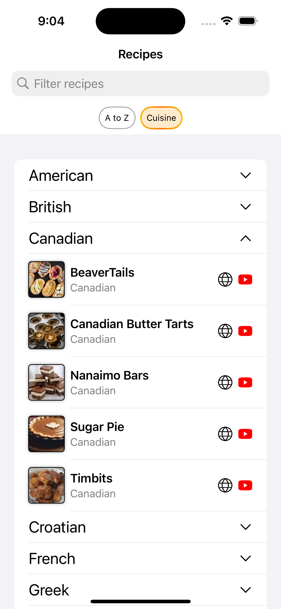
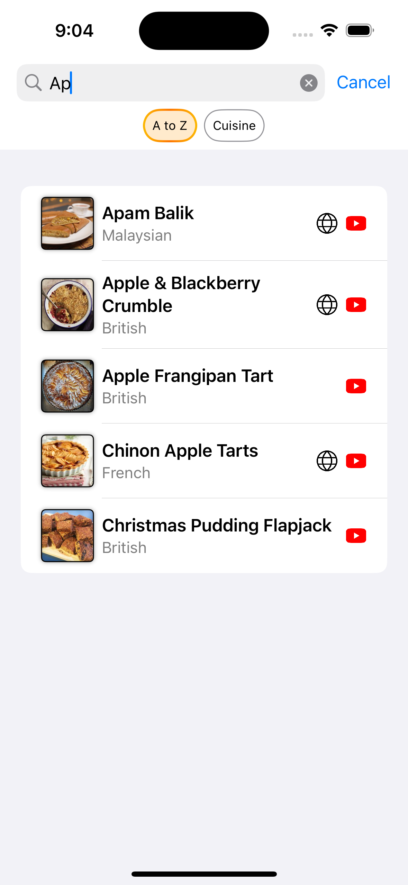

### Summary
Simple app showing recipes pulled from a static json list over the network and stored in SwiftData. User is shown the image, name, cuisine, and given links to source and YouTube if these links exist. There is a search bar that searches instantly over the recipe name and cuisine. User can also browse recipes grouped by cuisine and search that view as well. The recipe image is tappable and expands, which also downloads the higher quality image and shows that instead when available. Images are stored as data URLs in SwiftData as well.

#### Screenshots

#### Recording
[Screen recording](https://github.com/andrejpoljanec/FetchExercise/raw/refs/heads/main/FetchExercise/Screenshots/ScreenRecording.mp4)

### Focus Areas
Focus was on showing a little bit of everything:
- That I am able to refine the UI and split it into components and reusable code
- That I have ideas on what all we can add and want to find the right solution for each part, whether that's UI, network or db handling, or any other type of logic
- That I like structured code in a design pattern / architecture suitable to the project
- That I am willing to use the latest technology as much as possible even if there are some areas that need learning

### Time Spent
Altogether about 6 hours:
- 1 hours to set up the project and implement basic functionality listing recipes
- 2 hours to set up the architecture including SwiftData and networking
- 2 hours refining UI 
- 1 hour to clean up the code and write a few unit tests

### Trade-offs and Decisions
There are always things one can add to the app to showcase even more knowledge. I decided to try and show just a part of everything and present that I am able to work with it. So for example showing that I can implement a custom view, modifiers, layered architecture, helper classes, models, networking, database, etc., each has more or less just one example and none of them are heavily used. 

The biggest decision was to use SwiftData, which meant that the app can only support iOS 17 and up, and it also meant that I used new technology for me. I was usually using either CoreData or any of the third party libraries, so SwiftData was new for me. We always have to be careful to support more iOS versions and 17 as a minimum is not yet production ready. The challenge came with handling things a little bit differently, which I will briefly discuss in the next section as the weakest part of the project.

Another decision was to use singletons for networking and local persistence. Although not the best practice, I decided the app is simple enough to use it anyway. In general, I would implement a more complex architecture using dependency injection.

The last trade-off I want to mention is relatively small amount of unit testing. A few more could be added, but there is not much more pure logic to test, and the rest of the testing would probably be UI testing. Another reason was considering time since I wanted to show what I can do in 6 hours or less. 

### Weakest Part of the Project
While incorporating SwiftData into the app, I noticed I had to switch over some of the work to the main thread with `@MainActor`. This is obviously an anti-pattern, none of the db work should be performed on the main thread. Another issue with my approach was that some of the code could be inconsistent if the network/db traffic increased (maybe stress testing or scaling the app). The solution to these problems is to switch the whole SwiftDataService to be an actor, specifically a ModelActor. This would make sure db is accessed from the background actor one at a time. 

### Additional Information
The app can obviously be greatly improved. Whether that's UI, the architecture by using an actor instead of a class for db access, better code separation, more unit tests, etc. I'm happy to go over my implementation with you and discuss what could have been done differently, improved, and where potential issues might be. I'm always willing to learn from my mistakes and to share my learning experience with others to the benefit of the full team. After all, that's also one of the purposes of the code review where criticism should be taken seriously but not personally. 
